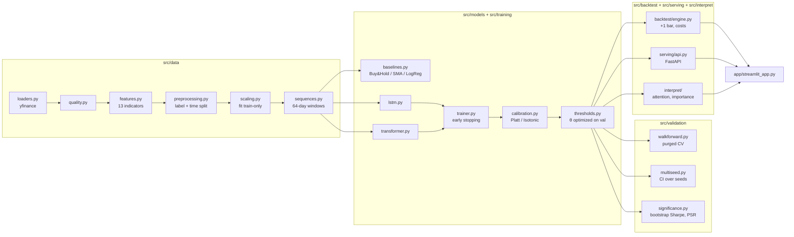

# Deep Learning Market Prediction

[](https://github.com/corentinperdrizet/deep-learning-market-prediction/actions/workflows/ci.yml)
[](https://www.python.org/)
[](LICENSE)

An end-to-end research pipeline for predicting short-horizon market direction with deep learning —
**data → baselines → LSTM/Transformer → calibration → backtest → statistical validation → serving**
— built to the standard of a production ML system, not a notebook.

The headline finding is intentionally unglamorous: at a 1-day horizon, the models beat a coin flip by
a small, fragile margin (ROC-AUC ≈ 0.50–0.54, walk-forward fold-to-fold std ≈ 0.09). That result, and
the rigor used to establish it honestly, is the point of this project — see
[Results & honest limitations](#results--honest-limitations).

## Table of contents

- [Architecture](#architecture)
- [Results & honest limitations](#results--honest-limitations)
- [Quickstart](#quickstart)
- [Project structure](#project-structure)
- [Methodology](#methodology)
- [Serving API](#serving-api)
- [Docker](#docker)
- [Testing & CI](#testing--ci)
- [Known trade-offs](#known-trade-offs)

## Architecture



Every stage is a plain Python module, callable both from a script (`python -m src.xxx`) and imported
directly (`train_lstm()`, `run_walkforward()`, `predict_latest()`, ...) — the CLI scripts and the
FastAPI service both call the exact same training/inference code, nothing is duplicated between them.

## Results & honest limitations

All numbers below are BTC-USD, 1-day horizon, `seq_len=64`, test period starting 2023-01-01, produced
by the commands in [Quickstart](#quickstart) — nothing here is hand-picked; regenerate them yourself.

| Model | Test ROC-AUC | Test PR-AUC | Notes |
|---|---:|---:|---|
| Buy & Hold | 0.500 | 0.501 | Predicts train-set base rate |
| SMA(50/200) | 0.491 | 0.497 | Rule-based, no learning |
| Logistic Regression | 0.513 | 0.516 | Tabular, last-timestep features |
| **LSTM** | **0.536** | **0.528** | 2-layer, hidden=128 |
| **Transformer** | **0.517** | **0.520** | 3-layer encoder, d_model=128 |

*(Last regenerated via `make baselines && make run && make transformer`. Exact figures drift slightly
run to run because `end=None` always fetches through the latest available trading day, so the test
window keeps extending forward.)*

**Why this matters more than the raw numbers**: a single train/val/test split can make a mediocre
model look good (or a good one look bad) by luck. This project doesn't stop at one split:

- **Walk-forward CV** (`make walkforward`) re-evaluates a model across 5 rolling out-of-sample windows
  with a purge/embargo gap. Measured: fold ROC-AUC ranging from **0.36 to 0.63** (mean 0.49, std
  0.093) — the single-split number sits well within the noise of what a different test window would
  have shown.
- **Multi-seed training** (`make multiseed`, 5 seeds) retrains the LSTM on the identical split.
  Measured: ROC-AUC mean **0.520**, 95% CI **[0.509, 0.531]**, std **0.009** — an order of magnitude
  tighter than the walk-forward fold-to-fold spread. Most of the uncertainty in this pipeline comes
  from *which period* you test on, not from training randomness.
- **Block-bootstrap Sharpe CI + Probabilistic Sharpe Ratio** (`make significance`): the LSTM's test
  backtest (θ re-optimized on validation) posts Sharpe **1.07**, but a 1000-draw circular block
  bootstrap puts the 95% CI at **[0.08, 2.02]** — barely above zero at the low end. The parametric
  Probabilistic Sharpe Ratio vs. a zero benchmark reads ≈1.0 (near-certainty), a real example of why
  a single "significance" number can overstate confidence relative to a resampling-based estimate;
  reporting both, rather than whichever looks better, is the point. The same command sweeps fees from
  0 to 100bps — Sharpe crosses zero well before 100bps, i.e. the edge is real but thin enough that
  execution costs matter. Worth flagging explicitly: the strategy's equity curve (`lstm_equity.png`,
  regenerated by the same command) sits well *below* a naive Buy & Hold on this BTC bull-market test
  window despite the positive Sharpe — a lower-volatility, mostly-flat strategy can post a decent
  risk-adjusted ratio while leaving most of the absolute upside on the table. Sharpe alone doesn't
  tell you that; look at the curve.
- **Cross-asset check** (`make multi-asset`): the identical architecture trained separately on
  BTC-USD, ETH-USD, and the S&P 500 (`^GSPC`) lands at ROC-AUC **0.536 / 0.537 / 0.497** respectively
  — the result isn't a BTC-specific artifact, and the S&P 500 (the most efficient, most scrutinized of
  the three markets) comes out indistinguishable from random, exactly as the efficient-market prior
  would predict.

This is consistent with the weak-form efficient market hypothesis at a 1-day horizon: a real, small,
hard-won signal, reported with the uncertainty it deserves, rather than an overfit number from a
single lucky split.

## Quickstart

```bash
python3 -m venv env && source env/bin/activate
make install-dev            # runtime + test/lint deps

make data                   # download + build the BTC-USD dataset
make baselines               # Buy&Hold / SMA / LogReg
make run                     # train the LSTM
make transformer             # train the Transformer
make vizu                    # training curves -> experiments/figures/

make walkforward             # purged cross-validation
make multiseed                # multi-seed confidence intervals
make significance             # bootstrap Sharpe CI, PSR, cost sensitivity
make multi-asset               # BTC-USD / ETH-USD / ^GSPC comparison
make interpret                 # permutation feature importance (LSTM)
make interpret-transformer     # + attention map (Transformer)

make app                     # Streamlit dashboard -> http://localhost:8501
make api                     # FastAPI inference service -> http://localhost:8000/docs

make test                   # 130+ tests, network-free, ~3s
make lint                   # ruff
```

## Project structure

```
src/
├── data/            # download -> quality checks -> features -> labels -> scaling -> sequences
├── models/           # LSTMClassifier, TransformerTimeSeriesClassifier, sklearn baselines
├── training/          # trainer.py (shared fit loop), run_lstm.py, run_transformer.py,
│                       # run_multi_asset.py, MLflow-tracked wrappers
├── backtest/           # +1-bar execution, cost model, Sharpe/Sortino/Calmar/MaxDD/Turnover
├── validation/          # walk-forward CV, multi-seed CI, bootstrap Sharpe + PSR + cost sweep
├── serving/             # FastAPI app + model_registry (self-describing checkpoint loading)
├── interpret/            # permutation importance, Transformer attention extraction
├── track/                # MLflow tracking helpers
├── viz/                  # training-curve plots
└── app/                   # Streamlit dashboard (Models / Backtest / Signals / Interpretability / Data)

tst/                    # 130+ pytest tests, fully network-free (synthetic fixtures, mocked yfinance)
data/                   # raw/processed/artifacts (gitignored, regenerated by the pipeline)
experiments/             # figures + local MLflow tracking store (gitignored)
```

## Methodology

**Data pipeline** (`src/data/`): 13 features per day (log return, 20-day volatility, RSI-14, MACD,
multi-horizon returns, cyclical day-of-week encoding). Labels use a telescoping log-return sum so a
sample's target is always the return of the day *after* its feature window ends — verified by
`tst/test_preprocessing.py`, which locks the exact formula so a future edit can't silently shift it by
a day. The scaler is fit on train only and never refit on val/test (`tst/test_scaling.py`).

**Models** (`src/models/`): baselines (Buy&Hold, SMA crossover, Logistic Regression), a 2-layer LSTM,
and a 3-layer pre-norm Transformer encoder with sinusoidal positional encoding and mean/CLS pooling.
Both deep models share one training loop (`src/training/trainer.py`) with early stopping, gradient
clipping, and `ReduceLROnPlateau` — the LSTM uses Adam, the Transformer AdamW, both configurable.

**Calibration & thresholding** (`src/training/calibration.py`, `thresholds.py`): Platt and Isotonic
calibration, plus a threshold search (F1 or Sharpe objective) done on validation and frozen before
touching the test set.

**Backtest** (`src/backtest/`): signals are shifted by exactly one bar before being applied
(`tst/test_backtest_engine.py` locks this), so a signal computed from day *t*'s close can only ever
trade day *t+1* — the standard anti-look-ahead guarantee.

**Validation rigor** (`src/validation/`) — the part most take-home projects skip:
- `walkforward.py`: expanding-window CV with a purge/embargo gap sized to the label horizon.
- `multiseed.py`: retrains across seeds, reports mean ± Student-t confidence interval (not a normal
  approximation, since seed counts are always small).
- `significance.py`: circular block bootstrap for the Sharpe ratio (autocorrelation-aware, unlike an
  i.i.d. bootstrap), the Probabilistic Sharpe Ratio (Bailey & López de Prado, 2012), and a transaction
  cost sensitivity sweep.

**Interpretability** (`src/interpret/`): model-agnostic permutation importance (one uniform
`predict_fn(X) -> proba` interface works for the LSTM, the Transformer, or any sklearn baseline — no
SHAP dependency needed), and a hand-rolled attention extractor for the Transformer's pre-norm encoder
layers (PyTorch's fast path doesn't expose attention weights through the normal forward pass).

## Serving API

`src/serving/model_registry.py` reconstructs a model purely from its checkpoint's `model_config`
metadata — no hyperparameters hardcoded in the serving layer — then applies the same
feature/scaling pipeline used at training time to the latest available window.

```bash
make api   # or: uvicorn src.serving.api:app --reload

curl http://localhost:8000/health
curl http://localhost:8000/models
curl "http://localhost:8000/predict/BTC-USD?model=lstm"
# {"ticker":"BTC-USD","model_kind":"lstm","as_of":"2026-07-30 00:00:00+00:00",
#  "probability_up":0.512,"signal":1,"threshold":0.4999...}
```

Interactive docs at `http://localhost:8000/docs` (FastAPI's built-in Swagger UI).

## Docker

```bash
make docker-build
make docker-up      # dashboard on :8501, API on :8000 (both read locally-trained artifacts)
make docker-down
```

`data/artifacts/`, `data/processed/`, and `experiments/figures/` are mounted read-only into the
containers, so training stays on the host (fast, uses local CPU/MPS/CUDA) while serving/dashboarding
runs identically in a container. `torch` is installed from PyTorch's CPU-only wheel index in the
Dockerfile — the default PyPI wheel bundles the full CUDA toolkit (~1.5GB of unused `nvidia-*`
packages on a container with no GPU), which otherwise triples the build time and image size.

Verified end-to-end: both containers build, start, and serve real predictions from host-trained
checkpoints (`curl localhost:8000/predict/BTC-USD?model=lstm` returns a live prediction). One
harmless artifact of that split between host training and containerized serving: scikit-learn's
pickled `scaler.joblib` triggers an `InconsistentVersionWarning` if the container's scikit-learn
minor version differs from the one used to train (pin `scikit-learn` exactly in `requirements.txt` if
you need to silence it — left loose here deliberately for broader compatibility).

## Testing & CI

130+ pytest tests, all deterministic and network-free (synthetic fixtures, mocked `yfinance`), run in
a few seconds: `make test`. GitHub Actions (`.github/workflows/ci.yml`) runs `ruff check`,
`ruff format --check`, and the full suite with a coverage gate on every push/PR, on Python 3.11 and
3.13.

The suite specifically locks in the properties that matter for a finance pipeline: the label formula
(no off-by-one leakage), the scaler never being refit on val/test, the backtest's +1-bar execution
lag, walk-forward's purge/embargo gap, and — as regression tests — six real bugs found and fixed
during a full review pass (a stale/never-reoptimized decision threshold, an unreachable dead training
loop for the Transformer, a shared scaler file silently corrupted by multi-asset training, and others;
see git history).

## Known trade-offs

Documented deliberately, not hidden:

- **Single-family models.** LSTM and Transformer only — no gradient-boosted trees on richer tabular
  features, which often compete well at this signal-to-noise ratio.
- **Daily bars only.** No intraday data, no order-book/microstructure features.
- **Walk-forward retrains a lighter model (LogReg by default) per fold** for speed; an `--model lstm`
  flag exists but multiplies runtime by the number of folds.
- **No live paper-trading loop.** The API serves point-in-time predictions; there's no scheduler or
  execution simulator wired up to run continuously.
